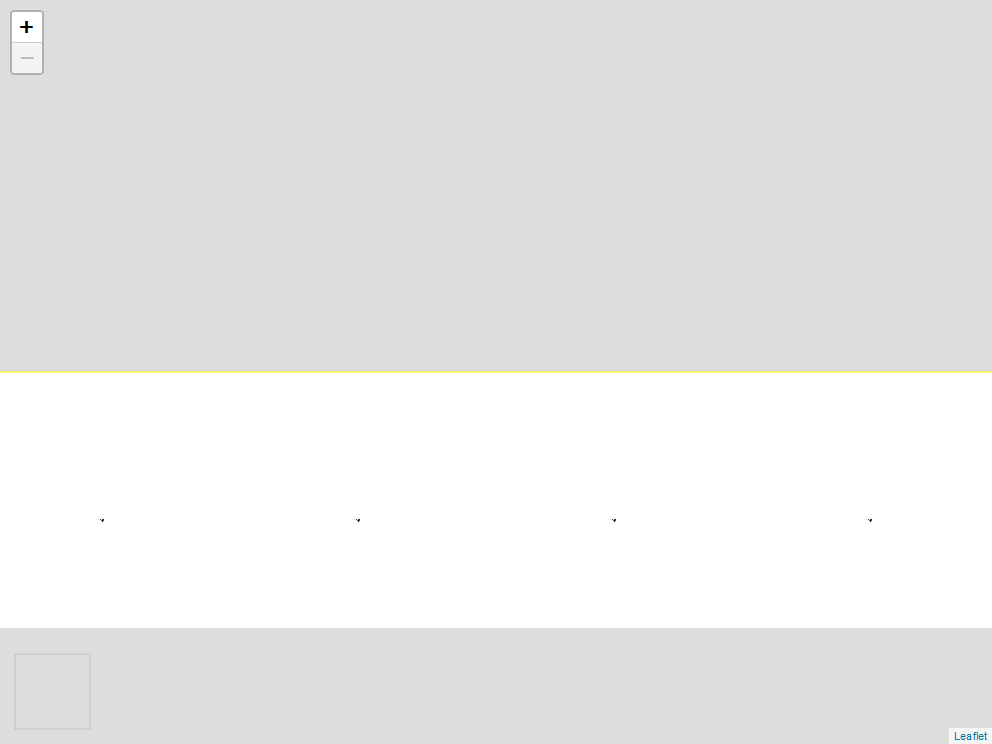

```{r setup, include=FALSE}
knitr::opts_chunk$set(echo = FALSE)
library(sf)
library(leaflet)
library(leafem)
library(raster)
library(geosphere)
```
# Criar objeto

```{r}
# 1. Digitação da Geometria
#  
# Digitar Coordenadas dos vértices
#
p42 <- st_point(x = c(738741.779, 7002404.540), dim = "XY")
p42 <- st_sfc(p42, crs = 31982) %>% 
  st_transform(crs = 4326)
p42 <- st_coordinates(p42)
p42A <- destPoint(p42, b = 120 + 3/60 + 37/3600, d = 45.08)
p43 <- destPoint(p42A, b = 110 + 42/60 + 49/3600, d = 65.62)
p44 <- destPoint(p43, b = 96 + 25/60 + 42/3600, d = 39.10)
p45 <- destPoint(p44, b = 70 + 34/60 + 36/3600, d = 16.79)
p46 <- destPoint(p45, b = 62 + 49/60 + 33/3600, d = 50.43)
p47 <- destPoint(p46, b = 178 + 4/60 + 9/3600, d = 36.48)
p49 <- destPoint(p47, b = 148 + 33/60 + 25/3600, d = 15.39)
p50 <- destPoint(p49, b = 140 + 20/60 + 6/3600, d = 36.91)
p51 <- destPoint(p50, b = 256 + 50/60 + 10/3600, d = 26.45)
p52 <- destPoint(p51, b = 299 + 24/60 + 56/3600, d = 32.34)
p53 <- destPoint(p52, b = 342 + 27/60 + 15/3600, d = 2.77)
p54 <- destPoint(p53, b = 310 + 9/60 + 46/3600, d = 35.82)
p55 <- destPoint(p54, b = 280 + 48/60 + 18/3600, d = 101.74)
p55A <- destPoint(p55, b = 256 + 55/60 + 3/3600, d = 44.66)
P42 <- destPoint(p55A, b = 357 + 48/60 + 17/3600, d = 73.27)
coords <- matrix(data = c(p42, p43, p44, p45, p46, p47, p49, p50, p51, p52, p53, 
                          p54, p55, p55A, p42), byrow = TRUE, ncol = 2)
#
# 2. Criação da feição  
#
# Atentar para a definição do crs apropriado
# 
#
# Exemplos:
# WGS 84 = 4326
# SAD 69 22S = 29192
# SIRGAS 2000 22S = 31982
#
pl <- st_sfc(st_polygon(list(coords)))
#
# 3. Criação dos metadados  
#
attr <- data.frame(
  destinacao = "ocupacao",
  rip = "8163 0102778-95",
  interessado = "Itapema Beach Place Empreendimentos S/A",
  area = 5416.88,
  area_uniao = 5416.88,
  nup = "04972.003387/2018-57",
  concedida = TRUE)
#
# 4. União dos atributos à geometria
#
# Atentar para a definição do crs apropriado
# 
#
# Exemplos:
# WGS 84 = 4326
# SAD 69 22S = 29192
# SIRGAS 2000 22S = 31982
#
spl_df <- st_sf(attr,
                geometry = pl, 
                crs = 4326)
```

# IMAGEM

```{r}
ext <- extent(spl_df)
m <- spl_df %>%
  leaflet() %>%
  #addTiles() %>%
  addWMSTiles(baseUrl = "http://sigsc.sc.gov.br/sigserver/SIGSC/wms", 
              layers = list("OrtoRGB-Landsat-2012")) %>%
# addProviderTiles(providers$Esri.WorldImagery) %>%
  addPolygons(stroke = TRUE, weight = 2, color = "yellow") %>%
  fitBounds(lng1 = ext[1], lat1 = ext[3], lng2 = ext[2], lat2 = ext[4]) %>% 
  addMouseCoordinates() %>%
  addLogo("../SPU.jpg", src = "local", position = "bottomleft", 
                  offset.x = 15, offset.y = 15, 
                  width = 75, height = 75)
mapview::mapshot(m, file = "./itapema_beach_place.png", remove_controls = NULL)

```

# SALVAR

```{r}
st_write(spl_df, "itapema_beach_place.geojson", delete_dsn = TRUE)
```

